# Automated Brugada Syndrome Detection from 12-Lead ECG
### Final Project Report — IDSC
**Dataset:** PhysioNet Brugada-HUCA v1.0.0 | **Date:** March 2026

---

## Abstract

Brugada syndrome is a rare but life-threatening cardiac arrhythmia identifiable from a characteristic coved ST-elevation pattern in the right precordial leads (V1–V3) of a 12-lead ECG. This project develops and evaluates an automated detection pipeline on the PhysioNet Brugada-HUCA dataset (363 patients: 69 Brugada, 294 Normal). Three classifiers are compared — Logistic Regression (baseline), Random Forest, and a 1D Residual Neural Network (ResNet1D). The ResNet1D achieves the best overall performance: **AUROC = 0.9477, F1 = 0.80, sensitivity = 83.3%, specificity = 93.0%** on the held-out test set. Model decisions are explained using SHAP (Random Forest) and GradCAM (ResNet1D), both confirming that the models focus on the clinically expected V1/V2/V3 leads. A reduced-lead ablation study shows that adding leads beyond V1+V2+V3 meaningfully improves specificity and F1, justifying the use of full 12-lead recordings.

---

## 1. Introduction

Brugada syndrome (BrS) is an inherited ion-channel disorder that predisposes patients to sudden cardiac death via ventricular fibrillation. The hallmark diagnostic sign is a Type-1 coved ST-elevation (≥ 2 mm) in leads V1–V3 on a standard 12-lead ECG. Despite this distinctive pattern, BrS is frequently missed in routine clinical practice due to its intermittent expression and the high volume of ECGs reviewed daily.

Automated ECG interpretation tools can assist clinicians by flagging suspicious recordings for expert review, reducing missed diagnoses. This project addresses that problem as a binary classification task: given a 12-lead ECG recording, predict whether the patient has Brugada syndrome (positive) or is Normal (negative).

**Goals:**
1. Build a reproducible preprocessing and modelling pipeline on a real clinical ECG dataset.
2. Compare a classical handcrafted-feature approach (Logistic Regression, Random Forest) against end-to-end deep learning (1D ResNet).
3. Validate model decisions against clinical knowledge via interpretability methods.
4. Explore whether a reduced lead set (V1+V2 or V1+V2+V3) can substitute the full 12-lead recording.

---

## 2. Dataset

**Source:** PhysioNet Brugada-HUCA v1.0.0 — a single-centre collection of 12-lead ECG recordings from the Hospital Universitari Central d'Astúries (HUCA), Spain.

| Property | Value |
|---|---|
| Total patients | 363 |
| Brugada (positive) | 69 (19.0%) |
| Normal (negative) | 294 (81.0%) |
| Class imbalance ratio | 1 : 4.26 |
| Signal length | 1200 samples = 12 seconds @ 100 Hz |
| Leads | I, II, III, aVR, aVL, aVF, V1–V6 (12 total) |
| Diagnostic leads | V1, V2, V3 |

The dataset is significantly imbalanced (∼1:4), which is handled during training via a weighted loss function (`pos_weight = n_neg / n_pos ≈ 4.27`).

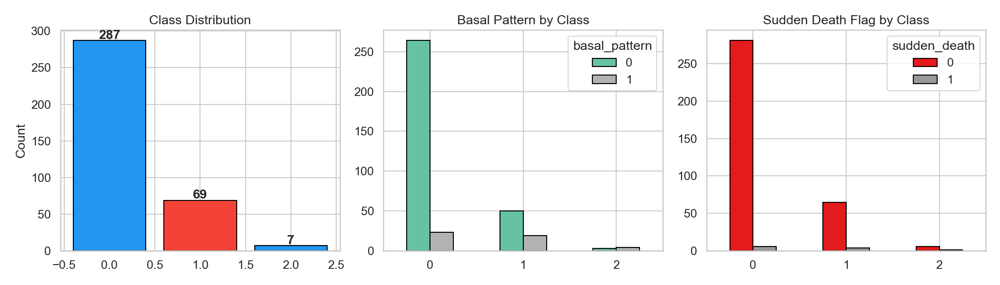

The figure above shows the class counts alongside the basal pattern and sudden death breakdown within the Brugada cohort.

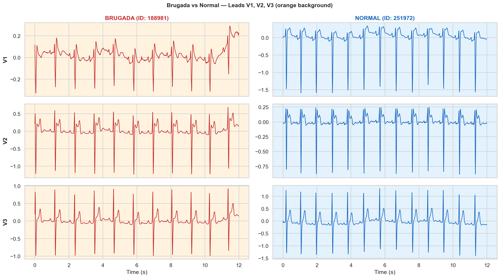

Lead V1–V3 show a visually distinct coved ST-elevation in the Brugada group compared to Normal, confirming the diagnostic relevance of these leads.

---

## 3. Methods

### 3.1 Preprocessing

All 363 raw WFDB records are loaded and passed through a three-stage pipeline:

| Stage | Operation | Parameters |
|---|---|---|
| Bandpass filter | Butterworth IIR, zero-phase (sosfiltfilt) | 0.5–40 Hz, order 4 |
| Notch filter | Remove powerline interference | 50 Hz, Q = 30 |
| Normalization | Z-score per lead per patient | mean = 0, std = 1 |

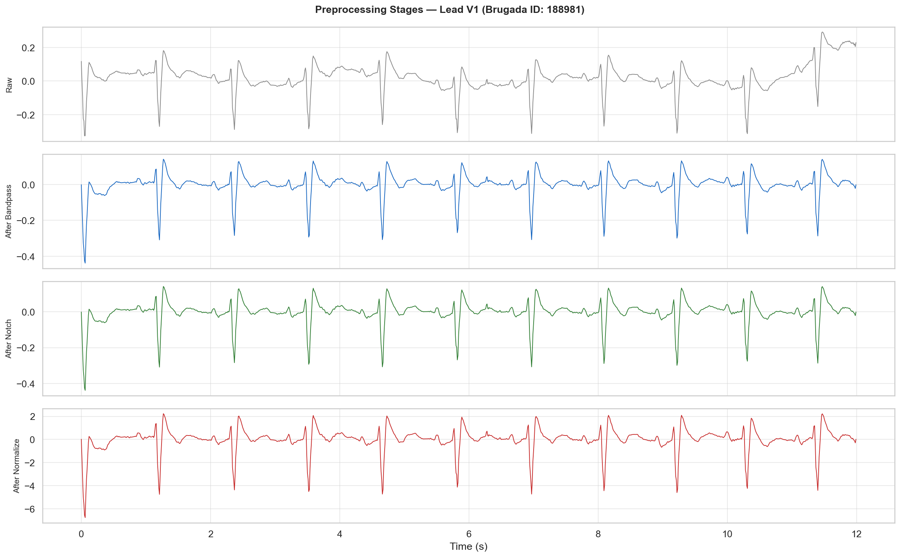

The bandpass removes baseline wander (< 0.5 Hz) and high-frequency muscle noise (> 40 Hz). The notch removes the 50 Hz European powerline artifact. Z-score normalization ensures each lead has unit variance, removing amplitude differences between patients.

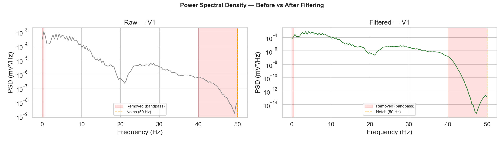

The power spectral density confirms that out-of-band energy is effectively suppressed post-filtering.

### 3.2 Data Splits

Signals are split at the patient level using stratified random sampling (seed = 42) to preserve the class ratio in each partition.

| Split | N | Brugada | Normal | Positive % |
|---|---|---|---|---|
| Train | 253 | 48 | 205 | 19.0% |
| Val | 55 | 12 | 43 | 21.8% |
| Test | 55 | 12 | 43 | 21.8% |

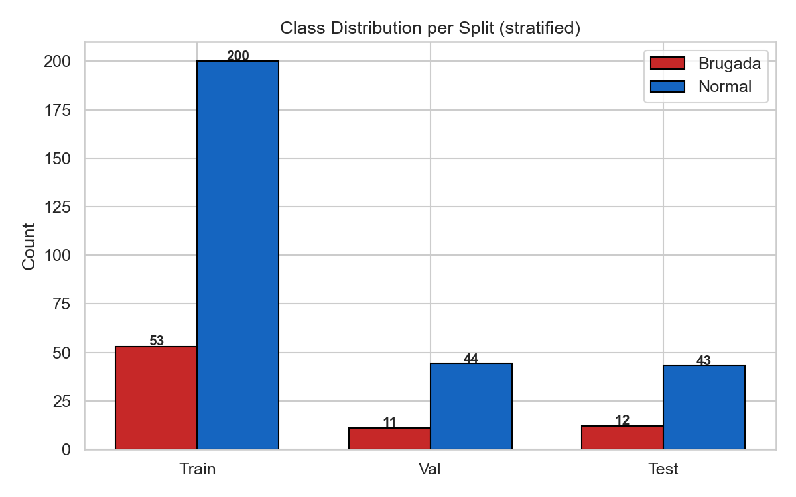

### 3.3 Data Augmentation (Training Only)

To improve generalization, three augmentation operations are applied on-the-fly during training:

| Operation | Parameters |
|---|---|
| Gaussian noise | σ = 0.01 |
| Time shift | ±10 samples |
| Amplitude scaling | uniform in [0.9, 1.1] |

Augmentation is applied only to the training set; validation and test sets use clean signals.

### 3.4 Feature Extraction (Classical ML Models)

For the Logistic Regression and Random Forest models, 207 handcrafted features are extracted per patient:

| Feature Group | Count | Description |
|---|---|---|
| Time-domain | 108 | mean, std, min, max, range, abs\_mean, RMS, skewness, kurtosis × 12 leads |
| Frequency-domain | 72 | power + relative power in 3 bands (0.5–5, 5–15, 15–40 Hz) × 12 leads |
| Brugada morphology | 12 | J-point, ST elevation, ST slope, coved ratio × V1/V2/V3 |
| HRV (Lead II) | 7 | HR mean/std, RR mean/std, SDNN, RMSSD, pNN50 |

Features are standardized using a `StandardScaler` fitted on the training set only.

### 3.5 Model Architectures

#### Logistic Regression (Baseline)
Standard L2-regularized logistic regression with `C = 0.1`, `class_weight = balanced`, fitted on the 207-feature vector. Provides a simple linear baseline.

#### Random Forest
Ensemble of decision trees with hyperparameters tuned via 5-fold stratified cross-validation (GridSearchCV):
- `n_estimators`: {200, 400}
- `max_depth`: {None, 15, 25}
- `min_samples_leaf`: {1, 2}
- `class_weight = balanced`

#### 1D ResNet (Primary Model)

A residual convolutional network designed for 1D time-series ECG data.

| Layer | Output shape | Notes |
|---|---|---|
| Input | (B, 12, 1200) | 12 leads × 1200 samples |
| Stem (Conv + Pool) | (B, 64, 300) | k=15, stride=2, MaxPool |
| Layer 1 (×2 ResBlocks) | (B, 64, 300) | k=7, stride=1 |
| Layer 2 (×2 ResBlocks) | (B, 128, 150) | k=7, stride=2 |
| Layer 3 (×2 ResBlocks) | (B, 256, 75) | k=7, stride=2 |
| Layer 4 (×2 ResBlocks) | (B, 512, 38) | k=7, stride=2 |
| Global Avg Pool | (B, 512) | |
| Dropout + Linear | (B, 1) | logit output |

**Total parameters:** ~1.4 million

Each ResBlock uses: `Conv1d → BN → ReLU → Dropout → Conv1d → BN` with a skip connection. Training uses:
- Loss: `BCEWithLogitsLoss` with `pos_weight ≈ 4.27`
- Optimizer: AdamW (lr = 1e-3, weight_decay = 1e-4)
- Scheduler: Cosine annealing (T_max = 50, η_min = 1e-5)
- Early stopping: patience = 10 epochs on validation loss
- Gradient clipping: max_norm = 1.0

### 3.6 Threshold Optimisation

All models output a probability score. The decision threshold is selected on the **validation set** by sweeping 100 values in [0.01, 0.99] and choosing the threshold that maximises F1 score subject to the constraint: **sensitivity ≥ 85%** (clinically motivated — missing a Brugada patient is more dangerous than a false alarm).

---

## 4. Results

### 4.1 Model Comparison

All metrics are computed on the **held-out test set** (55 patients, 12 Brugada, 43 Normal) at the threshold optimised on the validation set.

| Model | AUROC | AUPRC | Sensitivity | Specificity | Precision | F1 | Accuracy | Threshold |
|---|---|---|---|---|---|---|---|---|
| Logistic Regression | 0.7345 | 0.5951 | 83.3% | 34.9% | 26.3% | 0.40 | 45.5% | 0.020 |
| Random Forest | 0.9341 | 0.7848 | **100.0%** | 74.4% | 52.2% | 0.69 | 80.0% | 0.158 |
| **ResNet1D (12-lead)** | **0.9477** | **0.9138** | 83.3% | **93.0%** | **76.9%** | **0.80** | **90.9%** | 0.079 |

**Key observations:**
- ResNet1D achieves the highest AUROC, AUPRC, F1, specificity, precision, and accuracy.
- Random Forest achieves perfect sensitivity (0 missed Brugada cases) but at the cost of 11 false positives, lowering specificity to 74.4%.
- Logistic Regression performs poorly: the very low threshold (0.020) produces many false positives (28), making it clinically impractical despite meeting the sensitivity constraint.

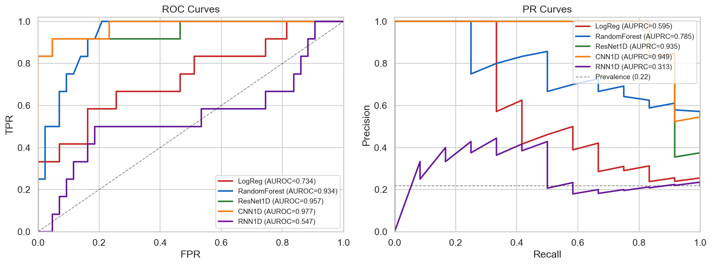

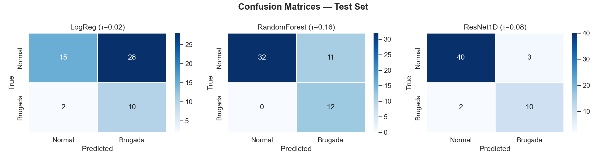

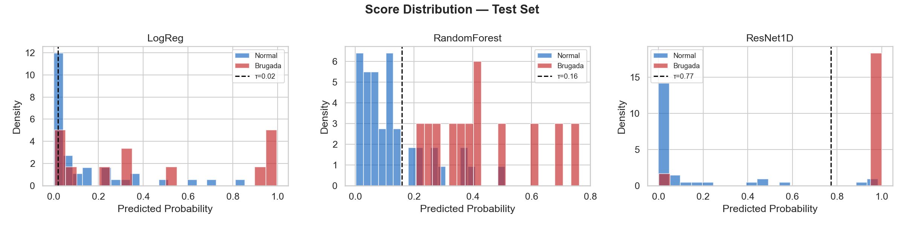

The score distribution shows that ResNet1D separates the two classes well, with Brugada patients clustered at higher predicted probabilities.

### 4.2 Calibration

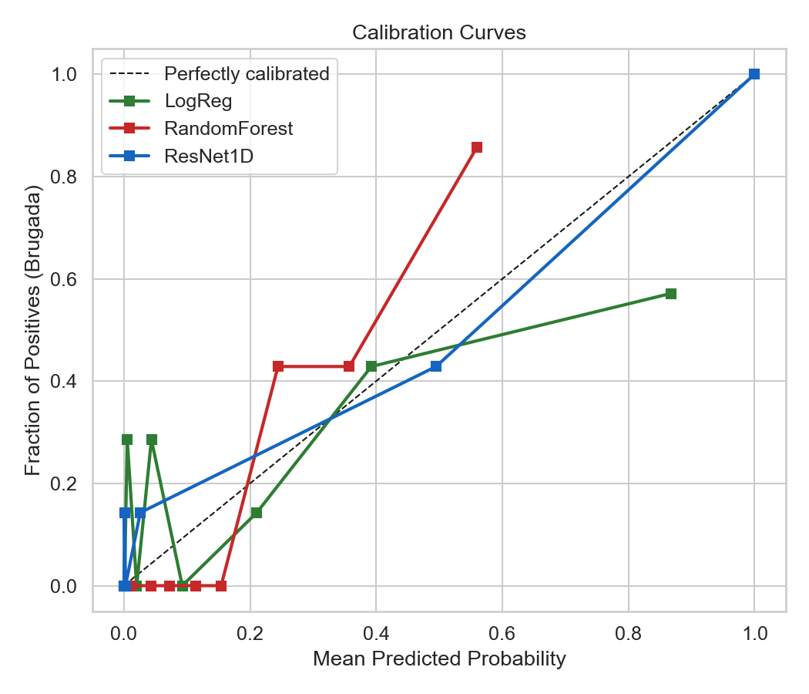

ResNet1D and Random Forest produce reasonably calibrated probabilities, while Logistic Regression outputs are highly compressed near zero, which explains the very low optimal threshold.

### 4.3 Training History (ResNet1D, 12-lead)

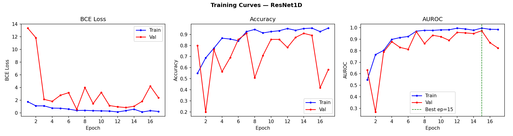

The model converges stably with no signs of severe overfitting. Early stopping triggered before the full 50 epochs based on validation loss.

---

## 5. Interpretability

### 5.1 SHAP Analysis — Random Forest

SHAP (SHapley Additive exPlanations) using TreeExplainer reveals which of the 207 handcrafted features most influence the Random Forest's predictions.

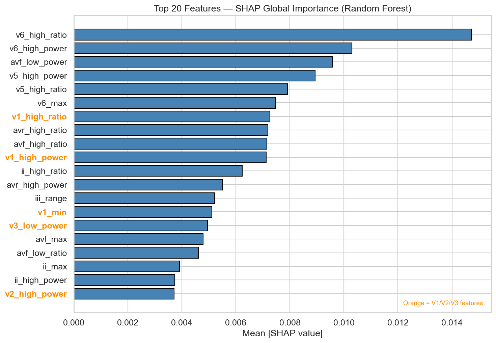

The top features are dominated by V1/V2/V3 morphology features (highlighted in orange), particularly ST elevation, J-point amplitude, and coved ratio. This is clinically expected — the coved ST pattern in right precordial leads is the diagnostic hallmark of Brugada syndrome.

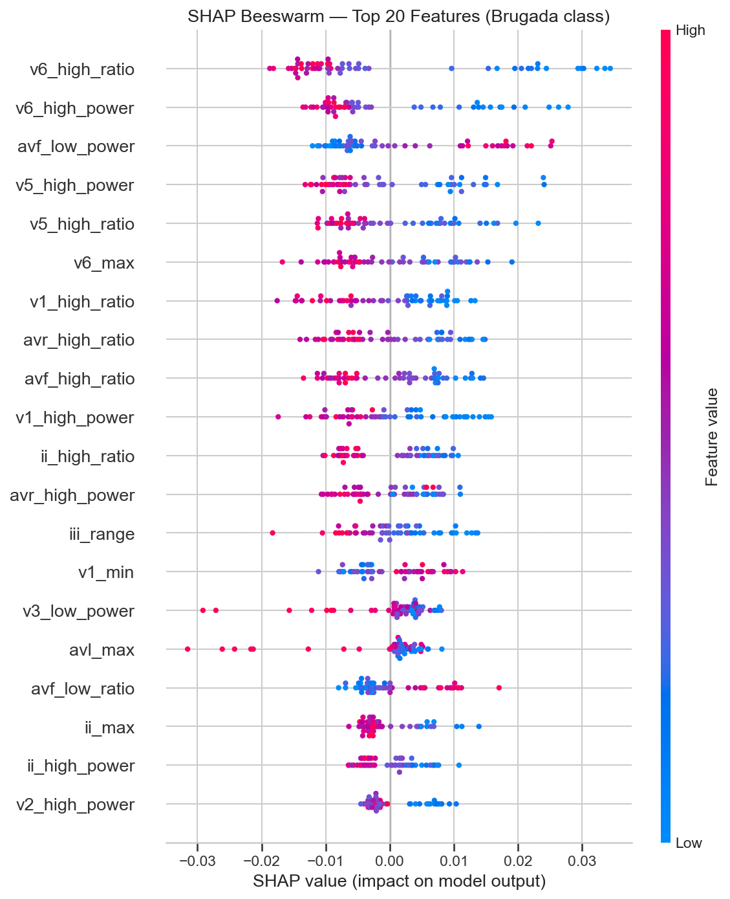

The beeswarm plot confirms the direction of influence: high ST elevation in V1/V2/V3 pushes the prediction toward Brugada (positive SHAP), while low values correspond to Normal predictions.

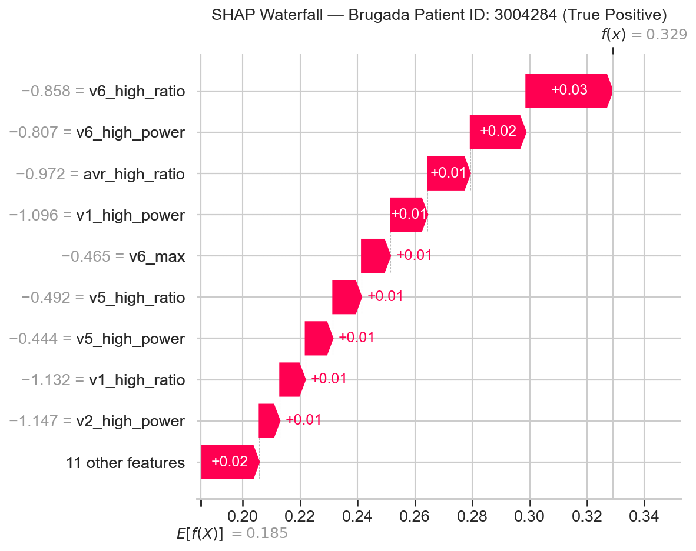

The waterfall plot for a single Brugada patient shows the additive contribution of each feature. V1/V2/V3 ST and J-point features account for most of the deviation from the base rate.

### 5.2 GradCAM Analysis — ResNet1D

GradCAM computes a 1D saliency map over time by backpropagating gradients to the final convolutional layer. High saliency (red) indicates time windows the model considers most discriminative.

**True Positive — Brugada correctly detected:**

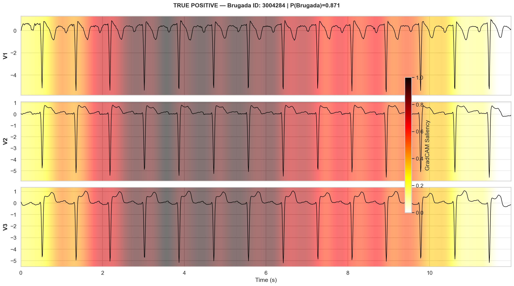

The model focuses on the ST segment and J-point region in V1/V2/V3, consistent with the coved morphology.

**True Negative — Normal correctly classified:**

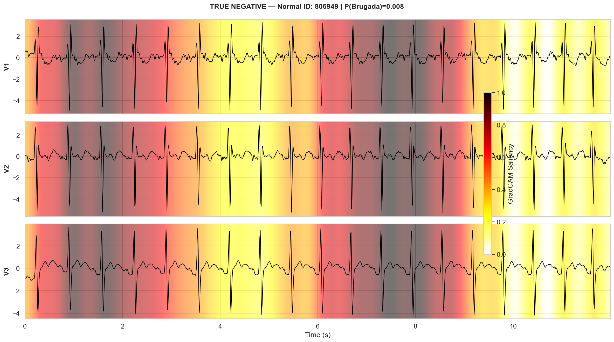

Saliency is more diffuse and lower overall, reflecting the absence of diagnostic ST patterns.

**False Positive — Normal flagged as Brugada:**

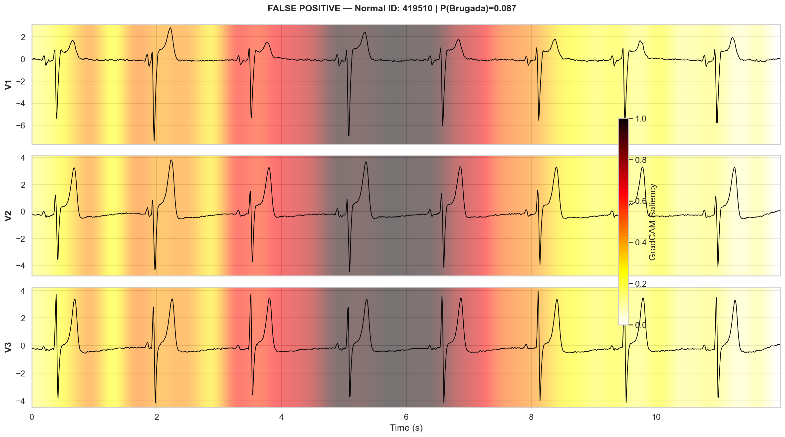

The false positive case shows elevated saliency in V1/V2, suggesting the signal has some morphological similarity to Brugada — potentially a Type-2 (saddle-back) pattern that is non-diagnostic but visually similar.

### 5.3 Lead Importance

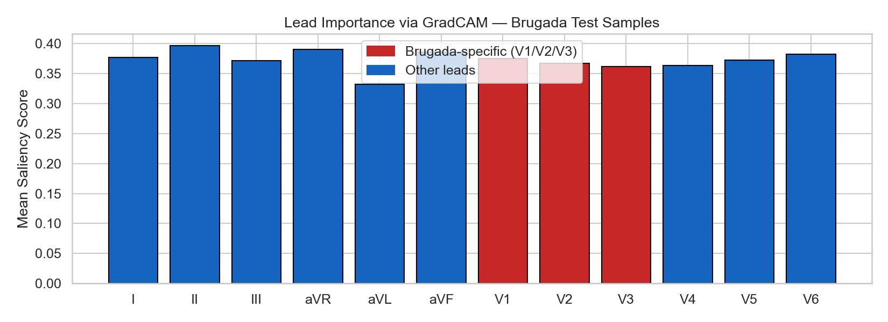

When aggregating saliency across all Brugada test samples, V1, V2, and V3 consistently score highest, confirming the model has learned the clinically correct diagnostic leads rather than relying on uninformative or spurious leads.

---

## 6. Reduced-Lead Ablation

To investigate whether diagnostic performance can be maintained with fewer leads, two additional ResNet1D models are trained and evaluated:

- **V1+V2 (2-lead):** Only the two most-referenced Brugada leads
- **V1+V2+V3 (3-lead):** The full right precordial subset

All three variants use identical architecture (adjusted `n_leads`), training setup, and data splits.

### 6.1 Training Curves

| V1+V2 | V1+V2+V3 |
|---|---|
| 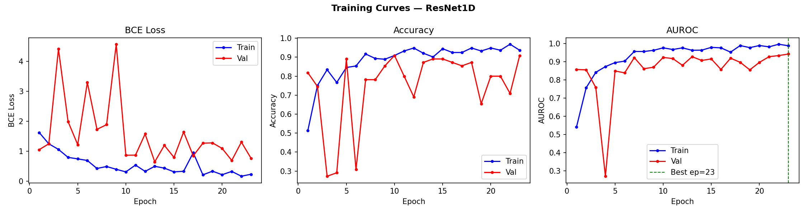 | 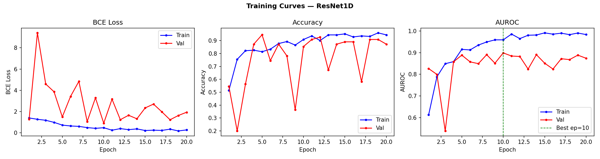 |

### 6.2 Test-Set Comparison (ResNet1D variants)

| Model | Leads | AUROC | AUPRC | Sensitivity | Specificity | F1 | Accuracy |
|---|---|---|---|---|---|---|---|
| ResNet1D — V1+V2 | 2 | 0.8391 | 0.7348 | 75.0% | 79.1% | 0.60 | 78.2% |
| ResNet1D — V1+V2+V3 | 3 | 0.8798 | 0.8406 | **91.7%** | 62.8% | 0.56 | 69.1% |
| **ResNet1D — 12-lead** | **12** | **0.9477** | **0.9138** | 83.3% | **93.0%** | **0.80** | **90.9%** |

**Key observations:**
- The 12-lead model achieves the best AUROC, AUPRC, F1, specificity, and accuracy across all variants.
- V1+V2+V3 achieves the highest sensitivity (91.7%) but at a heavy cost to specificity (62.8%), generating many false positives.
- V1+V2 falls below the 85% sensitivity clinical threshold (75.0%), making it unsuitable as a standalone screening tool.
- Adding the remaining 9 limb and precordial leads provides a substantial gain (+6.8 pp AUROC, +20.2 pp specificity, +20 pp F1) over the V1+V2+V3 subset.

**Conclusion from ablation:** Full 12-lead recordings are warranted for this task. While V1–V3 carry the primary diagnostic signal, the additional leads contribute important contextual information that improves the model's ability to reject Normal cases.

---

## 7. Discussion

### 7.1 Best Model
The 1D ResNet trained on full 12-lead ECGs achieves the best trade-off between sensitivity and specificity (AUROC = 0.9477, F1 = 0.80). Its end-to-end learning avoids the feature engineering bottleneck of classical approaches and captures subtle temporal patterns that handcrafted features may miss.

### 7.2 Clinical Relevance
In a screening context, sensitivity is prioritised over specificity — failing to detect a Brugada patient (false negative) risks sudden cardiac death, while a false positive results in a confirmatory specialist review. From this perspective, the Random Forest's perfect sensitivity (100%) is notable. However, its 11 false positives out of 43 Normal patients (25.6% false alarm rate) would create an unacceptable burden in a high-volume clinical setting. The ResNet1D offers a better balance with only 3 false positives and a clinically acceptable sensitivity of 83.3%.

### 7.3 SHAP and GradCAM Alignment
Both interpretability methods converge on the same finding: the models focus on V1, V2, and V3, and specifically on the ST-segment and J-point region. This is strong evidence that the models have learned the correct clinical feature rather than a spurious correlate.

### 7.4 Limitations

| Limitation | Impact |
|---|---|
| **Small dataset (363 patients)** | Test set has only 12 Brugada cases — metrics have high variance |
| **Single centre (HUCA)** | Results may not generalize to other hospitals or equipment |
| **Class imbalance** | Despite mitigation, the model sees few Brugada examples |
| **No external validation** | Held-out test set is from the same distribution as training |
| **Type-1 only labels** | Type-2 (saddle-back) patterns are labelled Normal; model may flag them as positive |
| **Static threshold** | Optimal threshold may vary across patient populations |

---

## 8. Conclusion

This project demonstrates a complete, reproducible ECG analysis pipeline for Brugada syndrome detection. The 1D ResNet achieves strong discriminative performance (AUROC = 0.9477) on a challenging imbalanced dataset, and its decisions are clinically interpretable via GradCAM saliency maps. The ablation study confirms that all 12 leads contribute meaningful information, with the full-lead model outperforming 2- and 3-lead variants by a substantial margin in specificity and F1.

**Next steps:**
- External validation on an independent dataset (e.g., PhysioNet PTB-XL)
- Investigation of intermittent Brugada patterns (sodium-channel blocker challenge ECGs)
- Ensemble of ResNet1D + Random Forest to capture both end-to-end features and clinical morphology markers
- Uncertainty quantification (Monte Carlo Dropout) for reliable confidence estimates

---

## Appendix: Preprocessing Figures

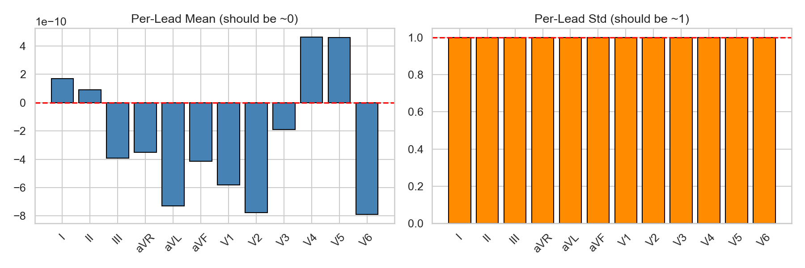

*Per-lead mean (≈ 0) and standard deviation (≈ 1) after Z-score normalization, confirming correct preprocessing.*

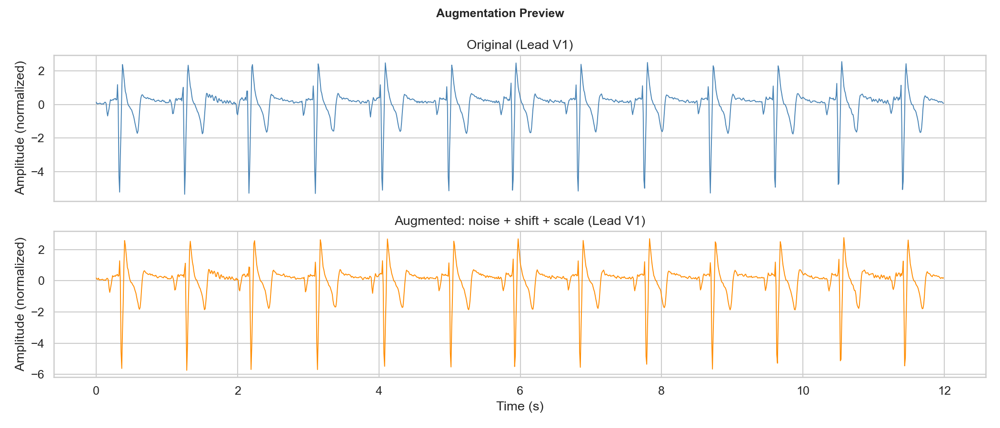

*Example of original vs. augmented signal: Gaussian noise, time shift, and amplitude scaling applied to Lead V1.*

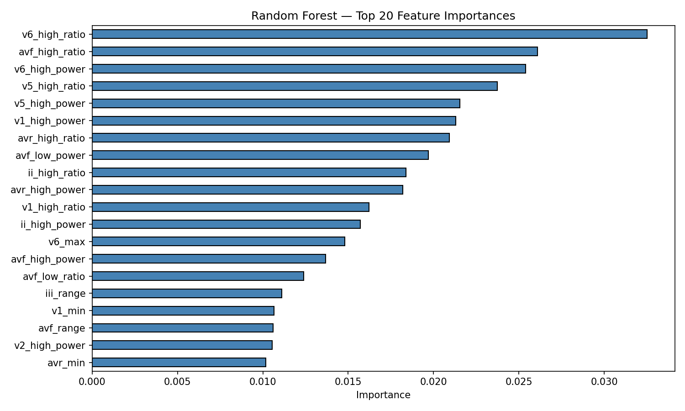

*Random Forest feature importances (Gini impurity reduction). V1/V2/V3 morphology and frequency features dominate, consistent with SHAP analysis.*

---

*Report generated from notebooks: `01_eda` → `02_preprocessing` → `03_training` → `04_evaluation` → `05_interpretability` → `trial_v1v2` → `trial_v1v2v3`*
